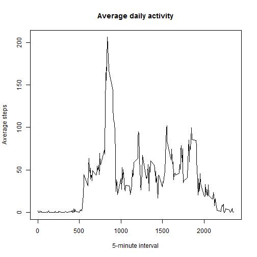

## Loading and preprocessing the data
1. Load the data (i.e. read.csv())

```r
library(plyr)
unzip("activity.zip")
```

```
## Warning in unzip("activity.zip"): error 1 in extracting from zip file
```

```r
filename <- "activity.csv"
DT <- (read.csv(filename, header = T))
```

2. Process/transform the data (if necessary) into a format suitable for your analysis

```r
Data_na_rm <- na.omit(DT)
```

## What is mean total number of steps taken per day?
1. Make a histogram of the total number of steps taken each day

```r
steps_per_day <- ddply(Data_na_rm, .(date), summarise, steps=sum(steps))
hist(steps_per_day$steps,
     main="Total number of steps taken per day",
     xlab="Steps per day")
```

 

2. Calculate and report the mean and median total number of steps taken per day

```r
mean  (steps_per_day$steps)
```

```
## [1] 10766.19
```

```r
median(steps_per_day$steps)
```

```
## [1] 10765
```

## What is the average daily activity pattern?
1. Make a time series plot (i.e. type = "l") of the 5-minute interval (x-axis) and the average number of steps taken, averaged across all days (y-axis)

```r
average_date <- ddply(Data_na_rm, .(interval), summarise, steps=mean(steps))
plot(average_date$interval, average_date$steps, type="l",
     main="Average daily activity", 
     xlab="5-minute interval", 
     ylab="Average steps")
```

 

2. Which 5-minute interval, on average across all the days in the dataset, contains the maximum number of steps?

```r
average_date[average_date$steps==max(average_date$steps),]
```

```
##     interval    steps
## 104      835 206.1698
```

## Imputing missing values
1. Calculate and report the total number of missing values in the dataset (i.e. the total number of rows with NAs)

```r
sum(is.na(DT$steps))
```

```
## [1] 2304
```

2. Devise a strategy for filling in all of the missing values in the dataset. The strategy does not need to be sophisticated. For example, you could use the mean/median for that day, or the mean for that 5-minute interval, etc.

```r
# Imputing NA's with average on 5-min interval
```

3. Create a new dataset that is equal to the original dataset but with the missing data filled in.

```r
newdata <- merge(DT, average_date, by="interval", suffixes=c("",".y"))
nas <- is.na(newdata$steps)
newdata$steps[nas] <- newdata$steps.y[nas]
newdata <- newdata[,c(1:3)]
#total number of rows with NAs
sum(is.na(newdata$steps))
```

```
## [1] 0
```

4. Make a histogram of the total number of steps taken each day and Calculate and report the mean and median total number of steps taken per day. Do these values differ from the estimates from the first part of the assignment? What is the impact of imputing missing data on the estimates of the total daily number of steps?

```r
new_daily_steps <- ddply(newdata, .(date), summarise, steps=sum(steps))
hist(new_daily_steps$steps,
     main="Total number of steps taken per day", 
     xlab="Steps per day")
```

 

```r
mean(new_daily_steps$steps)
```

```
## [1] 10766.19
```

```r
median(new_daily_steps$steps)
```

```
## [1] 10766.19
```

```r
# difference between datasets
daily_steps_1 <- sum(Data_na_rm$steps)
daily_steps_2 <- sum(newdata$steps)
daily_steps_2 -daily_steps_1
```

```
## [1] 86129.51
```
Mean values didn't change as imputation used the average on 5-min interval

## Are there differences in activity patterns between weekdays and weekends?
1. Create a new factor variable in the dataset with two levels -- "weekday" and "weekend" indicating whether a given date is a weekday or weekend day.

```r
day <- weekdays(as.Date(newdata$date))
newdata$day <- ifelse(day %in% c("суббота", "воскресенье"), "Weekend", "Weekday")
weekday_ <- ddply(subset(newdata, newdata$day == "Weekday"),"interval", summarize, total_steps = sum(steps))
weekend_ <- ddply(subset(newdata, newdata$day == "Weekend"),"interval", summarize, total_steps = sum(steps))
```

2. Make a panel plot containing a time series plot (i.e. type = "l") of the 5-minute interval (x-axis) and the average number of steps taken, averaged across all weekday days or weekend days (y-axis). The plot should look something like the following, which was created using simulated data:

```r
par(mfrow=c(2,1), mar = c(2, 2, 2, 2))
plot(weekday_$interval, weekday_$total_steps, type="l",
     main="Weekday",
     xlab="Interval",
     ylab="Total steps")
plot(weekend_$interval, weekend_$total_steps, type="l",
     main="Weekend",
     xlab="Interval",
     ylab="Total steps")
```

 
